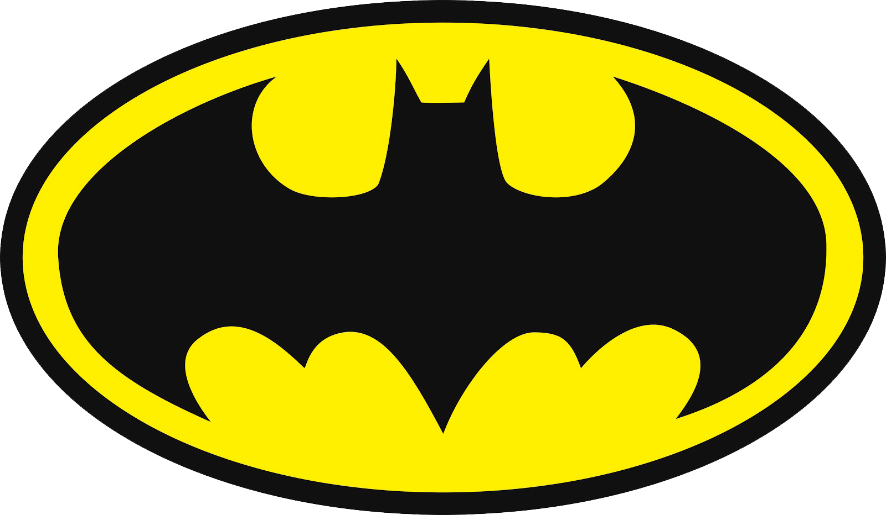

# Project-template
_a.k.a Project Plan_

This is just template for developers and project managers. 
Feel free to add other sections.

## Project Name

Choose appropriate project name that describes your idea.
Consider to use a short and simple name.

_For example:_

* Movies-App
* Project-A
* Lodash

## Project Logo(optional)

Choose logo for your project.
It can be icon or image. 
Try to be consistent with "Project Name" and use vector graphics.

_For example:_

Batman logo



## Goals

Describe your project.
Consider to use list and list items like so:

```
1) ....
2) ....
...
n) ....
```

_For example:_

```
1) Create recipes application.
2) Implement registration, login and sign out logic.
3) User can add new recipes.
4) User can edit existing recipes.
5) Users can discuss recipes in live-chat.
6) Users can share recipes via social media.
```

This is the main section of project template, so think over all aspects of your application/project. But trye to keep it simple.

## Tech stack

Describe all technologies that you are planning to use.
Split it to the sections: frontend, backend, tests, devops etc.
Feel free to add link for every technology.

Each list item can contain description.

_For example:_

### Frontend:
1) React(main framework/library)
2) Reach-router(routing library)
3) Effector(state manager)
4) [MaterialUI(UI library)](https://material-ui.com/)
5) Owl-carousel(carousel library)

### Backend:
1) [NestJS(main framework/platform)](https://nestjs.com/)
2) Typescript(language)
3) Fastify adapter(Nestjs adapter for Fastify)
4) MySQL(main database)
5) MongoDB(secondary database)
6) Redis(key-value storage)
7) Auth
  JWT + cookie(http-only)
  
### Tests
1) Jest
2) TS-Jest

### Devops
1) Vercel
2) Github Actions
3) Docker
4) Jenkins
 
## What will **BE** in the application?

Describe all features of your project.

_For example:_

1) Two-factor authentication with Apple ID.
2) Mobile first design.
3) Payments via different banks.
4) Mobile version in AppStore, Play Market.

## What will **NOT BE** in the application?

Describe what will not be in your application.

_For example:_

1) Payments with cryptocurrency.
2) Desktop application.

## Expected development time for MVP

Calculate average time for development in months.

_For example:_

~ 14 months.

## Project management strategy(optional)

Choose project managment strategy like: Agile, Waterfall, Scrum.
Write simple plan for one month(one period) of development.

_For example:_

Scrum:

Sprint duration: 2 weeks(½ month, 14 days)

Sprint planning duration: 7 days

Backlog: White board | Jira | Asana | Trello

Columns in tasks queue: 
1) Todo
2) In progress
3) Done
4) Extra

## Possible costs

Calculate all costs for first time or first period of development.
Than calculte full cost of the project.

_For example:_

1) Google Play licence - 50$
2) AppStore license - 100$
3) Backend server - 5$/month

Total: 50$ + 100$ + (5 * 14) = 220$

_14 months => Expected development time for MVP_